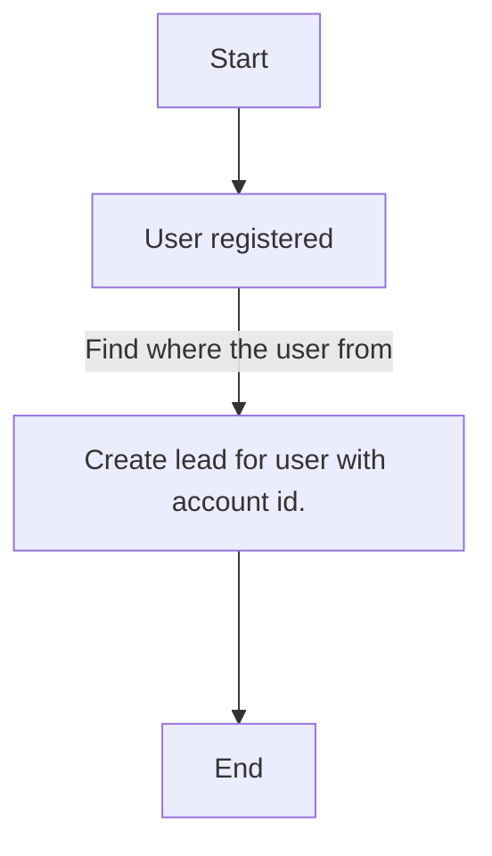
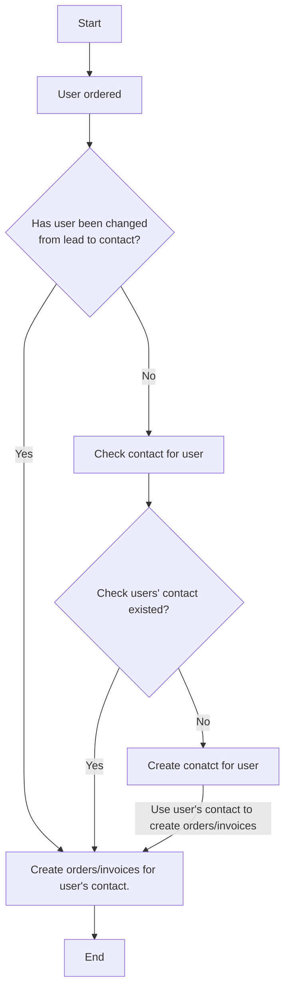
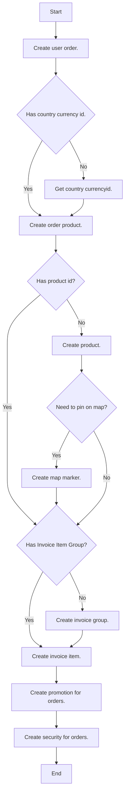

# V8 API GuideLine

## 1. 建立潛在客戶

[](https://mermaid-js.github.io/mermaid-live-editor/#/edit/eyJjb2RlIjoiZ3JhcGggVERcbiAgICBTdGFydFtTdGFydF0gLS0-IEFbVXNlciByZWdpc3RlcmVkXVxuICAgIEEgLS0gRmluZCB3aGVyZSB0aGUgdXNlciBmcm9tICAtLT4gQltDcmVhdGUgbGVhZCBmb3IgdXNlciB3aXRoIGFjY291bnQgaWQuXTtcbiAgICBCIC0tLT4gRW5kW0VuZF07XG4iLCJtZXJtYWlkIjp7InRoZW1lIjoiZGVmYXVsdCJ9LCJ1cGRhdGVFZGl0b3IiOmZhbHNlfQ)



會員留下任意聯絡資訊的時候視為潛在客戶

### 1.1. 建立潛在客戶

```json--request
HTTP/1.1 201
{
    "data": {
        "type": "Leads",
        "attributes": {
            "description": "Description",
            "account_id": "{{account_id}}",
            "salutation": "Mr.",
            "first_name": "Iam",
            "last_name": "Robot4",
            "title": "Mr.",
            "do_not_call": "0",
            "phone_home": "+886 8-88888888",
            "phone_mobile": "+886 912345678",
            "phone_work": "+886 7-77777777",
            "phone_other": "+886 6-66666666",
            "phone_fax": "+886 1234567890",
            "email1": "mark_huang1@owlting.com",
            "primary_address_street": "primary_address_street",
            "primary_address_street_2": "primary_address_street_2",
            "primary_address_street_3": "primary_address_street_3",
            "primary_address_city": "primary_address_city",
            "primary_address_state": "primary_address_state",
            "primary_address_postalcode": "primary_address_postalcode",
            "primary_address_country": "primary_address_country",
            "lawful_basis": "Consent",
            "lawful_basis_source": "Website",
            "date_reviewed": "2020-10-06",
            "converted": "0",
            "refered_by": "汪東城",
            "lead_source": "Web Site",
            "lead_source_description": "lead_source_description",
            "status": "New",
            "status_description": "lead_source_description",
            "birthdate": "2020-10-06",
            "website": "http://example.com",
        }
    }
}
```

`POST http://example.com/Api/V8/module`

<aside class="warning"><strong>Important</strong>: 保留 Lead id 以便後續可以轉換為真實客戶</aside>

```json--response
HTTP/1.1 200
{
    "data": {
        "type": "Lead",
        "id": "c5b0c6b8-dbcd-ac19-b0bf-5f7a92d51a15",
        "attributes": {
          ...
        },
        "relationships": {
          ...
        }
    }
}
```

## 2. 潛在客戶轉換成真實客戶

當使用者成功購買產品時

[](https://mermaid-js.github.io/mermaid-live-editor/#/edit/eyJjb2RlIjoiZ3JhcGggVERcbiAgICBTdGFydFtTdGFydF0gLS0-IEFbQ3JlYXRlVXNlciBvcmRlcmVkXVxuICAgIEEgLS0-ICBCe0hhcyB1c2VyIGJlZW4gY2hhbmdlZCA8YnI-IGZyb20gbGVhZCB0byBjb250YWN0P307XG4gICAgQiAtLSBZZXMgLS0-IENbQ3JlYXRlIG9yZGVycy9pbnZvaWNlcyBmb3IgdXNlcidzIGNvbnRhY3QuXTtcbiAgICBDIC0tPiBFbmRbRW5kXTtcbiAgICBCIC0tIE5vIC0tLS0-IERbQ2hlY2sgY29udGFjdCBmb3IgdXNlcl07XG4gICAgRCAtLT4gRXtDaGVjayB1c2VycycgY29udGFjdCBleGlzdGVkP31cbiAgICBFIC0tIFllcyAtLT4gQ1xuICAgIEUgLS0gTm8gLS0-IEZbQ3JlYXRlIGNvbmF0Y3QgZm9yIHVzZXJdO1xuICAgIEYgLS0gVXNlIHVzZXIncyBjb250YWN0IHRvIGNyZWF0ZSBvcmRlcnMvaW52b2ljZXMgLS0-IENcbiIsIm1lcm1haWQiOnsidGhlbWUiOiJkZWZhdWx0In0sInVwZGF0ZUVkaXRvciI6ZmFsc2V9)



### 2.1. 檢查潛在客戶是否曾經被轉換為真實客戶

```json--request
HTTP/1.1 200
{
    "data": [
        {
            "type": "Contact",
            "id": "914afaa0-022a-8bce-36de-5ea15dd6868d",
            "attributes": {
                ...
                "email1": "example@example.com",
                ...
            },
            "relationships": {
                ...
            }
        }
    ]
}
```

<aside class="warning"><strong>Information</strong>: 如果建立潛在客戶時選擇不保存 lead_id 則在查詢真實客戶時，務必小心使用 filter 的過濾功能，以免真實客戶被重複建立</aside>

`GET http://example.com/Api/V8/module/Contacts?filter[email1][eq]=example@example.com`

<aside class="info"><strong>Information</strong>: 成功建立過聯絡人則不再建立一次聯絡人</aside>

```json--response
HTTP/1.1 200
{
    "meta": {
        "message": "Request was successful, but there is no result"
    },
    "data": []
}
```

### 2.2. 若無真實客戶則需建立真實客戶

* 建立聯絡人

```json--request
{
    "data": {
        "type": "Contacts",
        "attributes": {
            "description": "Description",
            "account_id": "{{account_id}}",
            "salutation": "Mr.",
            "first_name": "Iam",
            "last_name": "Robot5",
            "title": "Mr.",
            "do_not_call": "0",
            "phone_home": "+886 8-88888888",
            "phone_mobile": "+886 912345678",
            "phone_work": "+886 7-77777777",
            "phone_other": "+886 6-66666666",
            "phone_fax": "+886 1234567890",
            "email1": "mark_huang1@owlting.com",
            "primary_address_street": "primary_address_street",
            "primary_address_street_2": "primary_address_street_2",
            "primary_address_street_3": "primary_address_street_3",
            "primary_address_city": "primary_address_city",
            "primary_address_state": "primary_address_state",
            "primary_address_postalcode": "primary_address_postalcode",
            "primary_address_country": "primary_address_country",
            "lawful_basis": "consent",
            "lawful_basis_source": "website",
            "date_reviewed": "2020-10-06",
            "birthdate": "2020-10-06",
            "birth_of_day_c": "birth_of_day_c",
            "birth_of_year_c": "birth_of_year_c",
            "birth_of_month_c": "birth_of_month_c"
        }
    }
}
```

`POST http://example.com/Api/V8/module`

<aside class="warning"><strong>Important</strong>: 保留 contact id 為後續建立關聯的活動紀錄</aside>

```json--response
HTTP/1.1 201
{
    "data": {
        "type": "Contact",
        "id": "ed9a0c87-aa99-83bc-2268-5f7a9afefd5f",
        "attributes": {
          ...
        },
        "relationships": {
          ...
        }
    }
}
```

### 2.3. 完成真實客戶建立後需與潛在客戶建立關聯

```json--request
HTTP/1.1 201
{
  "data": {
    "type": "Contacts",
    "id": "{{contact_id}}"
  }
}
```

需將 Leads 與 Contacts 建立關聯

* Create relationship

`POST http://example.com/Api/V8/module/Leads/{{lead_id}}/relationships`


```json--response
HTTP/1.1 201
{
    "meta": {
        "message": "Contact with id ed9a0c87-aa99-83bc-2268-5f7a9afefd5f has been added to Lead with id c5b0c6b8-dbcd-ac19-b0bf-5f7a92d51a15"
    },
    "data": []
}
```

### 2.4. 關聯潛在客戶及真實客戶後將 潛在客戶 標為已經 轉換過

```json--request
HTTP/1.1 201
{
  "data": {
    "type": "Lead",
    "id": "{{lead_id}}",
    "attributes": {
      "converted": "1",
      "status": "Converted"
    }
  }
}
```

### 2.5. 關聯真實客戶去相關的目標群組

{{suitecrm.url}}/Api/V8/module/ProspectLists/{{prospect_id}}/relationships

{
    "data": {
        "type": "Contacts",
        "id": "100fb6da-9b79-9bc5-67ee-5ff29ff7a135"
    }
}

`PATCH http://example.com/Api/V8/module`

## 3. 建立真實客戶銷售紀錄

在確定潛在客戶有消費之後將其轉換為真實客戶，並將其購買資訊送入

1. 先建立訂單 -> 後建立商品
2. 先建立商品 -> 後建立訂單

以下假設 1. 從訂單開始送 api，流程順序皆可異動




### 3.1. 取得幣別

<aside class="warning"><strong>Important</strong>: 幣別為後續產品及銷售紀錄的重要依據</aside>

`GET http://example.com/Api/V8/module/Currencies?page[size]=1&page[number]=1&filter[iso4217][eq]=EUR`

如果訂單為本位幣別 (台幣) 不需查詢並帶入-99

```json--request
```

```json--response
{
    "meta": {
        "total-pages": 1,
        "records-on-this-page": 1
    },
    "data": [
        {
            "type": "Currency",
            "id": "6ccfc88a-598b-898a-91f5-5f7ed4511cc2",
            "attributes": {
                "name": "EUR",
                "symbol": "EUR",
                "iso4217": "",
                "conversion_rate": "1.2",
                "status": "Active",
                "deleted": "0",
                "date_entered": "2020-10-08T08:58:00+08:00",
                "date_modified": "2020-10-08T08:58:00+08:00",
                "created_by": "1",
                "hide": "",
                "unhide": ""
            },
            "relationships": []
        }
    ],
    "links": {
        "first": null,
        "prev": null,
        "next": null,
        "last": null
    }
}
```

### 3.2. 取得產品類別編號

建立商品必須取得 sap 在 crm 相關的類別編號

`GET http://example.com/Api/V8/module/AOS_Product_Categories?page[size]=1&page[number]=1&filter[name][eq]=E`

```json--request
```

```json--response
{
    "meta": {
        "total-pages": 3,
        "records-on-this-page": 1
    },
    "data": [
        {
            "type": "AOS_Product_Categories",
            "id": "173f2e49-ebc0-ac85-f383-5f7d82c7b1fb",
            "attributes": {
                "name": "E",
                "date_entered": "2020-10-07T08:54:00+08:00",
                "date_modified": "2020-10-07T08:54:00+08:00",
                "modified_user_id": "4e640918-9db7-2121-94b5-5eba64642e0c",
                "modified_by_name": "Experience",
                "created_by": "4e640918-9db7-2121-94b5-5eba64642e0c",
                "created_by_name": "Experience",
                "description": "Experiences體驗大類",
                "deleted": "0",
                "created_by_link": "",
                "modified_user_link": "",
                "assigned_user_id": "1",
                "assigned_user_name": "Administrator",
                "assigned_user_link": "",
                "is_parent": "1",
                "aos_products": "",
                "sub_categories": "",
                "parent_category": {},
                "parent_category_name": "",
                "parent_category_id": ""
            },
            "relationships": {
                "AOS_Product_Categories": {
                    "links": {
                        "related": "V8/module/AOS_Product_Categories/173f2e49-ebc0-ac85-f383-5f7d82c7b1fb/relationships/parent_category"
                    }
                },
                "SecurityGroups": {
                    "links": {
                        "related": "V8/module/AOS_Product_Categories/173f2e49-ebc0-ac85-f383-5f7d82c7b1fb/relationships/SecurityGroups"
                    }
                },
                "Users": {
                    "links": {
                        "related": "V8/module/AOS_Product_Categories/173f2e49-ebc0-ac85-f383-5f7d82c7b1fb/relationships/created_by_link"
                    }
                }
            }
        }
    ],
    "links": {
        "first": null,
        "prev": null,
        "next": "V8/module/AOS_Product_Categories?page[size]=1&page[number]=2&filter[name][eq]=E&filter[description][eq]=Experiences體驗大類",
        "last": "V8/module/AOS_Product_Categories?page[size]=1&page[number]=3&filter[name][eq]=E&filter[description][eq]=Experiences體驗大類"
    }
}
```

### 3.3. 建立產品並取得編號

```json--request
{
    "data": {
        "type": "AOS_Products",
        "attributes": {
            "name": "MIS 【預購商品 佑爾康金貝親 HappyFamily有機蔬果牙餅 蘋果口味】用最天",
            "description": "MIS 【預購商品 佑爾康金貝親 HappyFamily有機蔬果牙餅 蘋果口味】用最天",
            "deleted": "0",
            "maincode": "XXXX",
            "part_number": "MISM01040500000282",
            "category": "category",
            "type": "Good",
            "cost": "180.000000",
            "cost_usdollar": "180.000000",
            "price": "180.000000",
            "price_usdollar": "180.00",
            "url": "",
            "contact_id": "",
            "contact": "",
            "product_image": "product_image",
            "file_url": "file_url",
            "aos_product_category_id": "{{product_category_id}}"
        }
    }
}
```

Product Id 為後續建立訂單資訊需要

`POST http://example.com/Api/V8/module`

<aside class="info"><strong>Important</strong>: 建立的產品為預設幣別不需要打入 currency_id</aside>

```json--response
{
    "data": {
        "type": "AOS_Products",
        "id": "ce76dfc3-6f7d-579e-9968-5fa3aab3122b",
        "attributes": {
            "name": "MIS 【預購商品 佑爾康金貝親 HappyFamily有機蔬果牙餅 蘋果口味】用最天",
            "date_entered": "2020-11-05T07:30:00+08:00",
            "date_modified": "2020-11-05T07:30:00+08:00",
            "modified_user_id": "1",
            "modified_by_name": "Administrator",
            "created_by": "1",
            "created_by_name": "Administrator",
            "description": "MIS 【預購商品 佑爾康金貝親 HappyFamily有機蔬果牙餅 蘋果口味】用最天",
            "deleted": "0",
            "created_by_link": "",
            "modified_user_link": "",
            "assigned_user_id": "",
            "assigned_user_name": "",
            "assigned_user_link": "",
            "aos_products_purchases": "",
            "maincode": "XXXX",
            "part_number": "MISM01040500000282",
            "category": "category",
            "type": "Good",
            "cost": "180.000000",
            "cost_usdollar": "180.000000",
            "price": "180.000000",
            "price_usdollar": "180.000000",
            "url": "",
            "contact_id": "",
            "contact": "",
            "product_image": "product_image",
            "file_url": "",
            "aos_product_category": "",
            "aos_product_category_name": "MIS",
            "aos_product_category_id": "3acafc7c-0a86-43fd-5ee5-5f7ec877ae39"
        },
        "relationships": {
            "AOS_Product_Categories": {
                "links": {
                    "related": "V8/module/ce76dfc3-6f7d-579e-9968-5fa3aab3122b/relationships/aos_product_category"
                }
            },
            "SecurityGroups": {
                "links": {
                    "related": "V8/module/ce76dfc3-6f7d-579e-9968-5fa3aab3122b/relationships/SecurityGroups"
                }
            },
            "Users": {
                "links": {
                    "related": "V8/module/ce76dfc3-6f7d-579e-9968-5fa3aab3122b/relationships/created_by_link"
                }
            }
        }
    }
}
```

#### 3.3.1 建立產品標記位置

`POST http://example.com/Api/V8/module`

```json--request
{
    "data": {
        "type": "jjwg_Markers",
        "attributes": {
            "name": "Mis Marker",
            "marker_type_c": "origin",
            "description": "體驗一日遊",
            "assigned_user_id": "123",
            "city": "",
            "state": "",
            "country": "",
            "jjwg_maps_lat": "123",
            "jjwg_maps_lng": "123",
            "marker_image": ""
        }
    }
}
```

```json--response
{
    "data": {
        "type": "jjwg_Markers",
        "id": "d8ff32e8-e906-e63e-d272-60c035051718",
        "attributes": {
            "name": "Mis Marker",
            "date_entered": "2021-06-09T03:27:00+00:00",
            "date_modified": "2021-06-09T03:27:00+00:00",
            "modified_user_id": "1",
            "modified_by_name": "Administrator",
            "created_by": "1",
            "created_by_name": "Administrator",
            "description": "體驗一日遊",
            "deleted": "0",
            "created_by_link": "",
            "modified_user_link": "",
            "assigned_user_id": "123",
            "assigned_user_name": "",
            "assigned_user_link": "",
            "SecurityGroups": "",
            "city": "",
            "state": "",
            "country": "",
            "jjwg_maps_lat": "100.00000000",
            "jjwg_maps_lng": "123.00000000",
            "marker_image": "",
            "jjwg_maps_jjwg_markers": "",
            "aos_products_jjwg_markers_1": "",
            "aos_products_jjwg_markers_1_name": "",
            "aos_products_jjwg_markers_1aos_products_ida": "",
            "marker_type_c": "origin"
        },
        "relationships": {
            "AOS_Products": {
                "links": {
                    "related": "V8/module/d8ff32e8-e906-e63e-d272-60c035051718/relationships/aos_products_jjwg_markers_1"
                }
            },
            "SecurityGroups": {
                "links": {
                    "related": "V8/module/d8ff32e8-e906-e63e-d272-60c035051718/relationships/SecurityGroups"
                }
            },
            "Users": {
                "links": {
                    "related": "V8/module/d8ff32e8-e906-e63e-d272-60c035051718/relationships/created_by_link"
                }
            }
        }
    }
}
```

#### 3.3.2 建立產品與位置的關聯

`POST http://example.com/Api/V8/module/AOS_Products/{{product_id}}/relationships`

```json--request
{
    "data": {
        "type": "jjwg_Markers",
        "id": "{{jjwg_marker_id}}"
    }
}
```

```json--response
{
    "meta": {
        "message": "jjwg_Markers with id d38e6cce-da04-b537-7d3a-60bd902c1f1a has been added to AOS_Products with id 2c9f7664-c4bc-b3fc-3f32-60bd903ad46d"
    },
    "data": []
}
```

### 3.4. 開始建立銷售紀錄

```json--request
{
    "data": {
        "type": "AOS_Invoices",
        "attributes": {
            "name": "MIS004",
            "description": "",
            "billing_account_id": "",
            "billing_account": "",
            "billing_contact_id": "670f411d-7f4f-abc5-d253-5eac39e93e09",
            "billing_contact": "",
            "billing_address_street": "",
            "billing_address_city": "",
            "billing_address_state": "",
            "billing_address_postalcode": "",
            "billing_address_country": "",
            "shipping_address_street": "",
            "shipping_address_city": "",
            "shipping_address_state": "",
            "shipping_address_postalcode": "",
            "shipping_address_country": "",
            "total_amt": "399.000000",
            "total_amt_usdollar": "399.000000",
            "subtotal_amount": "378.000000",
            "subtotal_amount_usdollar": "378.000000",
            "discount_amount": "-21.000000",
            "discount_amount_usdollar": "-21.000000",
            "tax_amount": "0.000000",
            "tax_amount_usdollar": "0.000000",
            "shipping_amount": "0.000000",
            "shipping_amount_usdollar": "0.000000",
            "shipping_tax": "0",
            "shipping_tax_amt": "0.000000",
            "shipping_tax_amt_usdollar": "0.000000",
            "total_amount": "378.000000",
            "total_amount_usdollar": "378.000000",
            "quote_date": "",
            "invoice_date": "202-02-03",
            "due_date": "",
            "status": "Paid",
            "subtotal_tax_amount": "",
            "subtotal_tax_amount_usdollar": "0.000000"
        }
    }
}
```

`POST {{suitecrm.url}}/Api/V8/module`

<aside class="info"><strong>Important</strong>: 建立的產品為預設幣別不需要打入 currency_id</aside>
<aside class="warning"><strong>Important</strong>: "quote_date": "", 需帶入請求內容</aside>

```json--response
{
    "data": {
        "type": "AOS_Invoices",
        "id": "b4534cda-6fe8-2926-47b4-5fa3d3146c98",
        "attributes": {
            "name": "MIS004",
            "date_entered": "2020-11-05T10:26:00+08:00",
            "date_modified": "2020-11-05T10:26:00+08:00",
            "modified_user_id": "1",
            "modified_by_name": "Administrator",
            "created_by": "1",
            "created_by_name": "Administrator",
            "description": "",
            "deleted": "0",
            "created_by_link": "",
            "modified_user_link": "",
            "assigned_user_id": "",
            "assigned_user_name": "",
            "assigned_user_link": "",
            "billing_account_id": "670f411d-7f4f-abc5-d253-5eac39e93e09",
            "billing_account": "EC_Market",
            "billing_contact_id": "",
            "billing_contact": "",
            "billing_address_street": "",
            "billing_address_city": "",
            "billing_address_state": "",
            "billing_address_postalcode": "",
            "billing_address_country": "",
            "shipping_address_street": "",
            "shipping_address_city": "",
            "shipping_address_state": "",
            "shipping_address_postalcode": "",
            "shipping_address_country": "",
            "number": "18985",
            "line_items": "",
            "total_amt": "399.000000",
            "total_amt_usdollar": "399.000000",
            "subtotal_amount": "378.000000",
            "subtotal_amount_usdollar": "378.000000",
            "discount_amount": "-21.000000",
            "discount_amount_usdollar": "-21.000000",
            "tax_amount": "0.000000",
            "tax_amount_usdollar": "0.000000",
            "shipping_amount": "0.000000",
            "shipping_amount_usdollar": "0.000000",
            "shipping_tax": "0",
            "shipping_tax_amt": "0.000000",
            "shipping_tax_amt_usdollar": "0.000000",
            "total_amount": "378.000000",
            "total_amount_usdollar": "378.000000",
            "quote_number": "0",
            "quote_date": "",
            "invoice_date": "",
            "due_date": "",
            "status": "Paid",
            "template_ddown_c": "",
            "subtotal_tax_amount": "0.000000",
            "subtotal_tax_amount_usdollar": "0.000000",
            "accounts": "",
            "contacts": "",
            "aos_quotes_aos_invoices": "",
            "aos_products_quotes": "",
            "aos_line_item_groups": "",
            "aos_invoices_aos_invoices_1": "",
            "invoice_datetime_c": ""
            "potr_c": ""
        },
        "relationships": {
            "AOS_Invoices": {
                "links": {
                    "related": "V8/module/b4534cda-6fe8-2926-47b4-5fa3d3146c98/relationships/aos_invoices_aos_invoices_1"
                }
            },
            "AOS_Line_Item_Groups": {
                "links": {
                    "related": "V8/module/b4534cda-6fe8-2926-47b4-5fa3d3146c98/relationships/aos_line_item_groups"
                }
            },
            "AOS_Products_Quotes": {
                "links": {
                    "related": "V8/module/b4534cda-6fe8-2926-47b4-5fa3d3146c98/relationships/aos_products_quotes"
                }
            },
            "AOS_Quotes": {
                "links": {
                    "related": "V8/module/b4534cda-6fe8-2926-47b4-5fa3d3146c98/relationships/aos_quotes_aos_invoices"
                }
            },
            "Accounts": {
                "links": {
                    "related": "V8/module/b4534cda-6fe8-2926-47b4-5fa3d3146c98/relationships/accounts"
                }
            },
            "Contacts": {
                "links": {
                    "related": "V8/module/b4534cda-6fe8-2926-47b4-5fa3d3146c98/relationships/contacts"
                }
            },
            "SecurityGroups": {
                "links": {
                    "related": "V8/module/b4534cda-6fe8-2926-47b4-5fa3d3146c98/relationships/SecurityGroups"
                }
            },
            "Users": {
                "links": {
                    "related": "V8/module/b4534cda-6fe8-2926-47b4-5fa3d3146c98/relationships/created_by_link"
                }
            }
        }
    }
}
```

### 3.5. 建立小計群組

將上述的商品價格總和折扣總和做初步計算並建立小計群組

```json--request
{
    "data": {
        "type": "AOS_Line_Item_Groups",
        "attributes": {
            "name": "name",
            "description": "description",
            "total_amt": "180.000000",
            "total_amt_usdollar": "180.000000",
            "discount_amount": "0.000000",
            "discount_amount_usdollar": "0.000000",
            "subtotal_amount": "180.000000",
            "subtotal_amount_usdollar": "180.000000",
            "tax_amount": "0.000000",
            "tax_amount_usdollar": "0.000000",
            "subtotal_tax_amount": "0.000000",
            "subtotal_tax_amount_usdollar": "0.000000",
            "total_amount": "180.000000",
            "total_amount_usdollar": "180.000000",
            "parent_type": "AOS_Invoices",
            "parent_id": "{{invoice_id}}",
            "number": "1",
        }
    }
}
```

`POST {{suitecrm.url}}/Api/V8/module`

<aside class="info"><strong>Important</strong>: 建立的產品為預設幣別不需要打入 currency_id</aside>

```json--response
{
    "data": {
        "type": "AOS_Line_Item_Groups",
        "id": "1f58e96f-f3aa-0937-f19d-5fa3d39107ce",
        "attributes": {
            "name": "name",
            "date_entered": "2020-11-05T10:27:00+08:00",
            "date_modified": "2020-11-05T10:27:00+08:00",
            "modified_user_id": "1",
            "modified_by_name": "Administrator",
            "created_by": "1",
            "created_by_name": "Administrator",
            "description": "description",
            "deleted": "0",
            "created_by_link": "",
            "modified_user_link": "",
            "assigned_user_id": "c56be602-4a6b-269c-e734-5eaeb97af366",
            "assigned_user_name": "ec_market",
            "assigned_user_link": "",
            "total_amt": "180.000000",
            "total_amt_usdollar": "180.000000",
            "discount_amount": "0.000000",
            "discount_amount_usdollar": "0.000000",
            "subtotal_amount": "180.000000",
            "subtotal_amount_usdollar": "180.000000",
            "tax_amount": "0.000000",
            "tax_amount_usdollar": "0.000000",
            "subtotal_tax_amount": "0.000000",
            "subtotal_tax_amount_usdollar": "0.000000",
            "total_amount": "180.000000",
            "total_amount_usdollar": "180.000000",
            "parent_name": "MIS004",
            "parent_type": "AOS_Invoices",
            "parent_id": "b4534cda-6fe8-2926-47b4-5fa3d3146c98",
            "number": "1",
            "aos_products_quotes": ""
        },
        "relationships": {
            "AOS_Products_Quotes": {
                "links": {
                    "related": "V8/module/1f58e96f-f3aa-0937-f19d-5fa3d39107ce/relationships/aos_products_quotes"
                }
            },
            "Users": {
                "links": {
                    "related": "V8/module/1f58e96f-f3aa-0937-f19d-5fa3d39107ce/relationships/created_by_link"
                }
            }
        }
    }
}
```

### 3.6. 先計算商品

```json--request
{
    "data": {
        "type": "AOS_Products_Quotes",
        "attributes": {
            "name": "name",
            "description": "description",
            "assigned_user_id": "c56be602-4a6b-269c-e734-5eaeb97af366",
            "part_number": "M01990100000001",
            "item_description": "",
            "number": "1",
            "product_qty": "1.0000",
            "product_cost_price": "180.000000",
            "product_cost_price_usdollar": "180.000000",
            "product_list_price": "180.000000",
            "product_list_price_usdollar": "180.000000",
            "product_discount": "0.000000",
            "product_discount_usdollar": "0.000000",
            "product_discount_amount": "",
            "product_discount_amount_usdollar": "",
            "discount": "Percentage",
            "product_unit_price": "0.000000",
            "product_unit_price_usdollar": "0.000000",
            "vat_amt": "0.000000",
            "vat_amt_usdollar": "0.000000",
            "product_total_price": "180.000000",
            "product_total_price_usdollar": "180.000000",
            "vat": "0",
            "parent_id": "{{invoice_id}}",
            "product_id": "{{product_id}}",
            "group_id": "{{item_group_id}}"
        }
    }
}
```

```json--response
```

再將產品成功建立後，後面便可以開始建立銷售單之中的商品

`POST {{suitecrm.url}}/Api/V8/module`

<aside class="info"><strong>Important</strong>: 建立的產品為預設幣別不需要打入 currency_id</aside>

```json--request
```

```json--response
{
    "data": {
        "type": "AOS_Products_Quotes",
        "id": "32685ba0-8270-7956-58b5-5fa512fd85e4",
        "attributes": {
            "name": "name",
            "date_entered": "2020-11-06T09:09:00+08:00",
            "date_modified": "2020-11-06T09:09:00+08:00",
            "modified_user_id": "1",
            "modified_by_name": "Administrator",
            "created_by": "1",
            "created_by_name": "Administrator",
            "description": "description",
            "deleted": "0",
            "created_by_link": "",
            "modified_user_link": "",
            "assigned_user_id": "c56be602-4a6b-269c-e734-5eaeb97af366",
            "assigned_user_name": "ec_market",
            "assigned_user_link": "",
            "part_number": "M01990100000001",
            "item_description": "",
            "number": "1",
            "product_qty": "1.0000",
            "product_cost_price": "180.000000",
            "product_cost_price_usdollar": "180.000000",
            "product_list_price": "180.000000",
            "product_list_price_usdollar": "180.000000",
            "product_discount": "0.000000",
            "product_discount_usdollar": "0.000000",
            "product_discount_amount": "0.000000",
            "product_discount_amount_usdollar": "0.000000",
            "discount": "Percentage",
            "product_unit_price": "0.000000",
            "product_unit_price_usdollar": "0.000000",
            "vat_amt": "0.000000",
            "vat_amt_usdollar": "0.000000",
            "product_total_price": "180.000000",
            "product_total_price_usdollar": "180.000000",
            "vat": "0",
            "parent_name": "MIS004",
            "parent_type": "AOS_Invoices",
            "parent_id": "b4534cda-6fe8-2926-47b4-5fa3d3146c98",
            "product_id": "ce76dfc3-6f7d-579e-9968-5fa3aab3122b",
            "group_name": "name",
            "group_id": "1f58e96f-f3aa-0937-f19d-5fa3d39107ce",
            "aos_products": "",
            "aos_contracts": "",
            "aos_quotes": "",
            "aos_invoices": ""
        },
        "relationships": {
            "AOS_Contracts": {
                "links": {
                    "related": "V8/module/32685ba0-8270-7956-58b5-5fa512fd85e4/relationships/aos_contracts"
                }
            },
            "AOS_Invoices": {
                "links": {
                    "related": "V8/module/32685ba0-8270-7956-58b5-5fa512fd85e4/relationships/aos_invoices"
                }
            },
            "AOS_Products": {
                "links": {
                    "related": "V8/module/32685ba0-8270-7956-58b5-5fa512fd85e4/relationships/aos_products"
                }
            },
            "AOS_Quotes": {
                "links": {
                    "related": "V8/module/32685ba0-8270-7956-58b5-5fa512fd85e4/relationships/aos_quotes"
                }
            },
            "Users": {
                "links": {
                    "related": "V8/module/32685ba0-8270-7956-58b5-5fa512fd85e4/relationships/created_by_link"
                }
            }
        }
    }
}
```

### 3.7. 建立與促銷的關聯

`GET http://example.com/Api/V8/module/OWL_Promotions?page[size]=1&page[number]=1&filter[code][eq]=123456`


```json--response

```

`POST http://example.com/Api/V8/module/AOS_Invoices/{{invoice_id}}/relationships`

<aside class="info"><strong>Important</strong>: 建立的產品為預設幣別不需要打入 currency_id </aside>

### 3.8. 銷售單建立與權限群組的關聯

```json--request
{
    "data": {
        "type": "SecurityGroups",
        "id": "a253557e-40f7-11eb-8665-fa163ef36d26"

    }
}
```

Group             | id
----------        | --
Experiece         | a253557e-40f7-11eb-8665-fa163ef36d26

`POST http://example.com/Api/V8/module/AOS_Invoices/{{invoice_id}}/relationships`

```json--response

```

## 4. 銷售單退款

範例，對銷售單的單據進行全額銷退

### 4.1. 查詢銷售單單號

若無保留銷售單單號者, 須透過查詢該筆銷售單的 uuid，並其關聯方式，取得訂單完整資訊

`GET {{suitecrm.url}}/{{suitecrm.url}}/Api/V8/module/AOS_Invoices?filter[name][eq]=OTR2020121600004&page[size]=1&page[number]=1`

<aside class="info"><strong>Tip</strong>: filter 條件可以多塞幾個參數確保查詢訂單的正確性 </aside>

<aside class="warning"><strong>Warning!</strong>: 正常情況下，訂單為唯一編號，查詢訂單需要注意回傳 total-pages 及 records-on-this-page 是不是為 1 </aside>

```json--response
{
    "meta": {
        "total-pages": 2,
        "records-on-this-page": 1
    },
    "data": [
        {
            "type": "AOS_Invoices",
            "id": "10afcf29-ee9d-dd48-0f94-5ff2edc88302",
            "attributes": {
                ...
            },
            "relationships": {
                ...
            }
    ],
    "links": {
        ...
    }
}
```

### 4.2. 取得該訂單相關的資訊 (query order information)

透過之前取得的 relationships 相關參數

<aside class="warning"><strong>Warning!</strong>: line_items_group 有可能有兩組以上</aside>

`Get {{suitecrm.url}}/Api/V8/module/AOS_Invoices/10afcf29-ee9d-dd48-0f94-5ff2edc88302/relationships/aos_line_item_groups`

```json--request
"AOS_Line_Item_Groups": {
  "links": {
    "related": "V8/module/AOS_Invoices/10afcf29-ee9d-dd48-0f94-5ff2edc88302/relationships/aos_line_item_groups"
  }
}
```

```json--response
{
    "data": [
        {
            "type": "AOS_Line_Item_Groups",
            "id": "4d1c43b8-b50d-0881-bd1a-5ff2edb8efd1",
            "links": {
                "self": "V8/module/AOS_Line_Item_Groups/4d1c43b8-b50d-0881-bd1a-5ff2edb8efd1"
            }
        }
    ]
}
```

### 4.3. 建立相對的銷退單據 (create return invoice)

銷退單據建立方式同建立銷售單，差異為:

* Status：銷退
* 金額：負數
* 銷退單：不需建立促銷關聯

以下例子為全都銷退:

### 4.4. 取得 currencies id

<aside class="warning"><strong>Important</strong>: 幣別為後續產品及銷售紀錄的重要依據</aside>

`GET http://example.com/Api/V8/module/Currencies?page[size]=1&page[number]=1&filter[iso4217][eq]=EUR`

如果訂單為本位幣別 (台幣) 不需查詢並帶入-99

```json--response
{
    "meta": {
        "total-pages": 1,
        "records-on-this-page": 1
    },
    "data": [
        {
            "type": "Currency",
            "id": "6ccfc88a-598b-898a-91f5-5f7ed4511cc2",
            "attributes": {
                ...
            },
            "relationships": []
        }
    ],
    "links": {
        ...
    }
}
```

### 4.5. 查詢 product 並取得 id

`GET http://example.com/Api/V8/module/AOS_Products?page[size]=1&page[number]=1&filter[name][eq]=E&filter[description][eq]=Experiences`

已有相關聯的產品uuid 則不用查詢

```json--reponse
{
    "data": {
        "type": "AOS_Products",
        "attributes": {
            "name": "MIS 【預購商品 佑爾康金貝親 HappyFamily有機蔬果牙餅 蘋果口味】用最天",
            "description": "MIS 【預購商品 佑爾康金貝親 HappyFamily有機蔬果牙餅 蘋果口味】用最天",
            "deleted": "0",
            "maincode": "XXXX",
            "part_number": "MISM01040500000282",
            "category": "category",
            "type": "Good",
            "cost": "180.000000",
            "cost_usdollar": "180.000000",
            "price": "180.000000",
            "price_usdollar": "180.00",
            "url": "",
            "contact_id": "",
            "contact": "",
            "product_image": "product_image",
            "file_url": "file_url",
            "aos_product_category_id": "{{product_category_id}}"
        }
    }
}
```

Product Id 為後續建立訂單資訊需要

`POST http://example.com/Api/V8/module`

<aside class="info"><strong>Important</strong>: 建立的產品為預設幣別不需要打入 currency_id</aside>

```json--response
{
    "data": {
        "type": "AOS_Products",
        "id": "ce76dfc3-6f7d-579e-9968-5fa3aab3122b",
        "attributes": {
            ...
        },
        "relationships": {
            ...
        }
    }
}
```

### 4.6. 開始建立銷退紀錄 (create return)

```json--request
{
    "data": {
        "type": "AOS_Invoices",
        "attributes": {
            "name": "MIS004",
            "description": "",
            "billing_account_id": "",
            "billing_account": "",
            "billing_contact_id": "670f411d-7f4f-abc5-d253-5eac39e93e09",
            "billing_contact": "",
            "billing_address_street": "",
            "billing_address_city": "",
            "billing_address_state": "",
            "billing_address_postalcode": "",
            "billing_address_country": "",
            "shipping_address_street": "",
            "shipping_address_city": "",
            "shipping_address_state": "",
            "shipping_address_postalcode": "",
            "shipping_address_country": "",
            "total_amt": "-399.000000",
            "total_amt_usdollar": "-399.000000",
            "subtotal_amount": "-378.000000",
            "subtotal_amount_usdollar": "-378.000000",
            "discount_amount": "21.000000",
            "discount_amount_usdollar": "21.000000",
            "tax_amount": "0.000000",
            "tax_amount_usdollar": "0.000000",
            "shipping_amount": "0.000000",
            "shipping_amount_usdollar": "0.000000",
            "shipping_tax": "0",
            "shipping_tax_amt": "0.000000",
            "shipping_tax_amt_usdollar": "0.000000",
            "total_amount": "-378.000000",
            "total_amount_usdollar": "-378.000000",
            "quote_date": "",
            "invoice_date": "2020-02-03",
            "due_date": "",
            "status": "Returned",
            "subtotal_tax_amount": "",
            "subtotal_tax_amount_usdollar": "0.000000"
        }
    }
}
```

這邊的 invoice id 為 return_invoice_id

`POST {{suitecrm.url}}/Api/V8/module`

<aside class="info"><strong>Important</strong>: 建立的產品為預設幣別不需要打入 currency_id</aside>
<aside class="warning"><strong>Important</strong>: "quote_date": "", 需帶入請求內容</aside>

```json--response
{
    "data": {
        "type": "AOS_Invoices",
        "id": "b4534cda-6fe8-2926-47b4-5fa3d3146c98",
        "attributes": {
            ...
        },
        "relationships": {
            ...
        }
    }
}
```

### 4.7. 銷退單建立小計群組

將上述的商品價格總和折扣總和做初步計算並建立小計群組

```json--request
{
    "data": {
        "type": "AOS_Line_Item_Groups",
        "attributes": {
            "name": "name",
            "description": "description",
            "total_amt": "-180.000000",
            "total_amt_usdollar": "-180.000000",
            "discount_amount": "0.000000",
            "discount_amount_usdollar": "0.000000",
            "subtotal_amount": "-180.000000",
            "subtotal_amount_usdollar": "-180.000000",
            "tax_amount": "0.000000",
            "tax_amount_usdollar": "0.000000",
            "subtotal_tax_amount": "0.000000",
            "subtotal_tax_amount_usdollar": "0.000000",
            "total_amount": "180.000000",
            "total_amount_usdollar": "180.000000",
            "parent_type": "AOS_Invoices",
            "parent_id": "{{return_invoice_id}}",
            "number": "1",
        }
    }
}
```

`POST {{suitecrm.url}}/Api/V8/module`

<aside class="info"><strong>Important</strong>: 建立的產品為預設幣別不需要打入 currency_id</aside>

```json--response
{
    "data": {
        "type": "AOS_Line_Item_Groups",
        "id": "1f58e96f-f3aa-0937-f19d-5fa3d39107ce",
        "attributes": {
            ...
        },
        "relationships": {
            ...
        }
    }
}
```

### 4.8. 銷退單先計算商品

```json--request
{
    "data": {
        "type": "AOS_Products_Quotes",
        "attributes": {
            "name": "name",
            "description": "description",
            "assigned_user_id": "c56be602-4a6b-269c-e734-5eaeb97af366",
            "part_number": "M01990100000001",
            "item_description": "",
            "number": "1",
            "product_qty": "1.0000",
            "product_cost_price": "-180.000000",
            "product_cost_price_usdollar": "-180.000000",
            "product_list_price": "-180.000000",
            "product_list_price_usdollar": "-180.000000",
            "product_discount": "0.000000",
            "product_discount_usdollar": "0.000000",
            "product_discount_amount": "",
            "product_discount_amount_usdollar": "",
            "discount": "Percentage",
            "product_unit_price": "0.000000",
            "product_unit_price_usdollar": "0.000000",
            "vat_amt": "0.000000",
            "vat_amt_usdollar": "0.000000",
            "product_total_price": "-180.000000",
            "product_total_price_usdollar": "-180.000000",
            "vat": "0",
            "parent_id": "{{return_invoice_id}}",
            "product_id": "{{product_id}}",
            "group_id": "{{item_group_id}}"
        }
    }
}
```

再將產品成功建立後，後面便可以開始建立銷售單之中的商品

`POST {{suitecrm.url}}/Api/V8/module`

<aside class="info"><strong>Important</strong>: 建立的產品為預設幣別不需要打入 currency_id</aside>


```json--response
{
    "data": {
        "type": "AOS_Products_Quotes",
        "id": "32685ba0-8270-7956-58b5-5fa512fd85e4",
        "attributes": {
            ...
        },
        "relationships": {
            ...
        }
    }
}
```

### 4.9. 建立銷退單與原始單據關聯

Group      | id
---------- | --
Experiece  | a253557e-40f7-11eb-8665-fa163ef36d26
Market     | 70b1530c-40da-11eb-8665-fa163ef36d26

`POST http://example.com/Api/V8/module/AOS_Invoices/{{invoice_id}}/relationships`

```json--request
{
    "data": {
        "type": "AOS_Invoices",
        "id": "{{return_invoice_id}}"
    }
}
```
